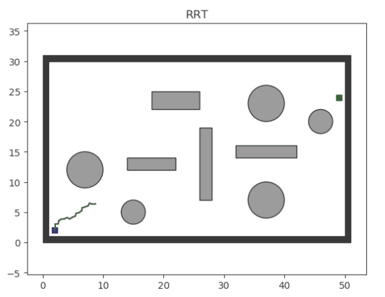
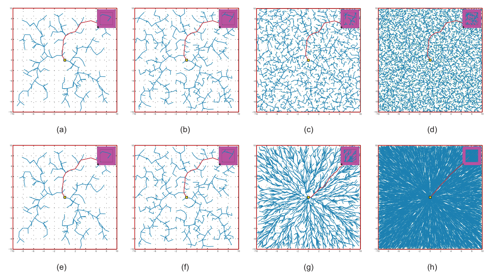
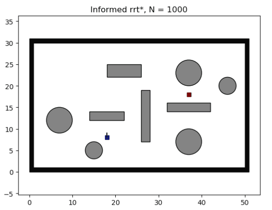
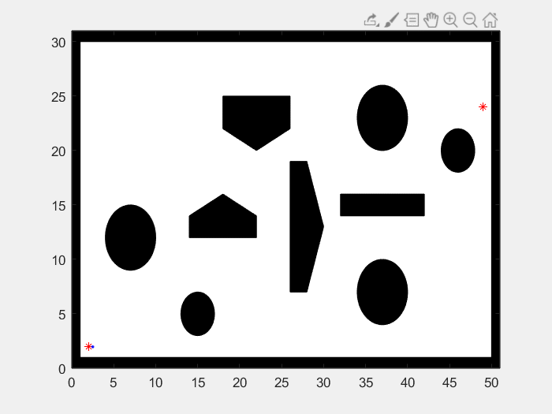
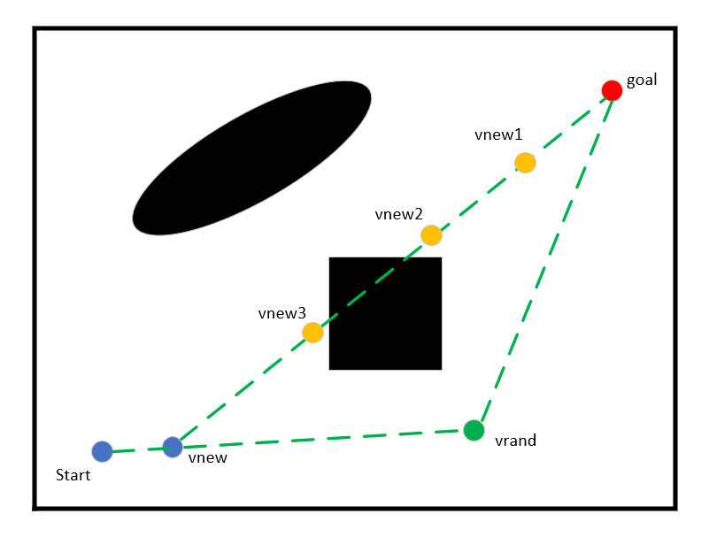
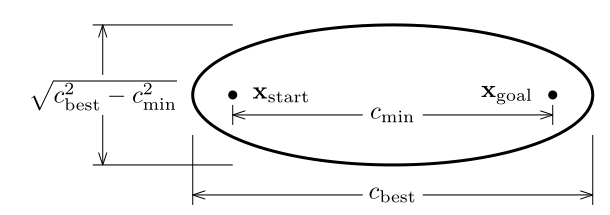
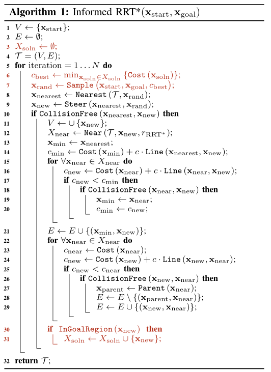

# 基于采样的路径规划算法总结

路径规划算法大致可以分为两类，一类是基于搜索的规划，另一类就是本文将要涉及的基于采样的规划。一般而言，基于搜索的规划（如A*）通常是运行在栅格地图上的。当栅格的分辨率越高时，算法搜索的路径就会越优。

还有一类算法是基于采样的，主要就是RRT和它的变种算法。这类算法的核心在于随机采样，从父节点开始，随机在地图上生成子节点，连接父子节点并进行碰撞检测，若无碰撞，就扩展该子节点。就这样，不断地随机扩展样本点，直到生成一条连接起点和终点的路径。如下图所示，RRT算法的扩展图与盘根错节的树枝十分相似。



RRT算法是一种快速搜索算法，但是它却是以牺牲最优性为代价的。RRT算法搜索到的路径往往不是最优路径。为了解决这个问题，后来出现了RRT* ，使得RRT拥有了**渐进最优的特性**。如下图所示，随着节点数量的增加，RRT* 会不断地优化路径，最终趋近于最优。



虽然 RRT* 拥有了在理论上可以找到最优路径的能力，但这种向最优逼近的速度并不快。因此，为了提高 RRT* 的收敛速度，Informed-RRT* 出现了，提高了初始路径向最优路径的收敛速度。

Informed-RRT* 的主要思路是在于椭圆的一个特性：**椭圆上的点到椭圆两个焦点的距离之和相同，而椭圆外的点到椭圆两个焦点的距离之和大于前者，内点则反之。**

当Informed-RRT* 第一次找到一条可用路径时，就会根据该路径长度画出一个椭圆，该椭圆上的点到两焦点的距离就是该路径长度。因此，为了优化当前路径，算法只需要在该椭圆内扩展样本即可。每当找到一条更短路径，椭圆的范围也会随着变小，如下图所示。



本质上，Informed-RRT* 提供了一个向最优路径优化的方向，从而极大地提高它的收敛速度。这种优化方法使得RRT的样本不再是**均匀（uniform）**的随机扩展，而是**有偏向（bias）**的随机扩展。

下面是我用MATLAB对RRT、RRT-CONNECT、RRT* 、Informed-RRT* 算法的编程实现。

## 1.RRT

关于RRT的编程实现比较简单，但我初次编程时仍然有很多需要注意的地方。首先理一理RRT的整体执行流程：


1. 初始化节点扩展的步长$step$。初始化VERTEX表格，该表格用于储存每次随机生成的且满足条件的节点，然后把起点加入到V表中；

2. 以整张地图为范围，随机生成一组坐标，以此作为一个新节点$v_{rand}$。然后根据V表，从中找到离$v_{rand}$最近的节点作为它的父节点$v_{nearest}$；

3. 计算$v_{rand}$与$v_{nearest}$的距离，取与步长相比较后的最小值，防止两节点之间的距离过长；

   ```matlab
   dist = min([norm(new_vertex-near_vertex),step_len]);  % 两节点之间的距离
   theta = atan2(new_node.ny-near_node.ny,new_node.nx-near_node.nx);  % 两节点之间的方向
   new_node.nx = near_node.nx + dist*cos(theta);
   new_node.ny = near_node.ny + dist*sin(theta);
   ```

4. 对于edge($v_{rand}$, $v_{nearest}$)进行碰撞检测，若满足要求，则将该节点加入到V表中。反之，则返回第二步；

5. 判断$v_{rand}$与终点的距离，若其小于步长并且之间无碰撞，则把终点加入到V表中，并设置$v_{rand}$为终点的父节点，然后根据父节点提取出一条可行路径。反之，则返回第二步。

观察代码和可视化图像，可以发现，RRT算法并没有设置任何优化路径的程序。当RRT发现一条可连接起点与终点的可行路径时，就直接把这条路径作为最终解。也就是说，RRT只能找到一个可行解，但不保证该解就是最优解。

## 2.RRT-CONNECT

观察可视化图像，可以发现RRT的均匀采样（uniform sample）很没有效率，会把大部分的采样点放在无意义的区域。如果我们可以缩小这个区域，那么就可以极大提高算法寻径的效率，这也就是所谓的偏置采样（bias sample）。

RRT-CONNECT为了提高RRT算法的效率，做出了两点改进：

> The method is based on two ideas: the Connect heuristic that attempts to move over a longer distance, and the growth of RRTs from both $q_{init}$ and $q_{goal}$.

1. 采用贪婪策略进行采样，算法会尝试往距离更远的地方移动；
2. 采用双向生长，即起点和终点均作为生长树的起点。

关于第一点可能比较难以理解。简单来说，因为该算法是双向生长的，当两个树的某两个节点之间存在可生长空间（即不会与障碍物碰撞）时，算法会优先在这两个节点之间扩展新节点。这样就可以让两个生长树快速相交。



这里主要说明RRT-CONNECT与RRT算法不同的地方。首先，由于前者是双向生长的，因此需要两个VERTEX表格，用于储存从起点和从终点扩展的节点。接下来，详细介绍RRT-CONNECT扩展节点的过程：

1. 首先，在地图范围内随机确定一个节点$v_{rand}$，然后找到新节点与V1表（从起点开始）中所有节点的最近节点作为$v_{nearest}$；
2. 由于刚开始V1表中只有起点，若两点之间无碰撞，则会从起点附近扩展出一个新节点$v_{new}$（规范化距离后的$v_{rand}$）；
3. 接下来，算法会从V2表（从终点开始）中找到与$v_{new}$最近的节点$v_{new2}$，同样V2表中只有终点，当两点无碰撞时，会从终点附近扩展出一个新节点$v_{new2}$（规范化）；
4. 此时，算法判断节点$v_{new}$与$v_{new2}$之间存在可扩展的空间。于是不再随机扩展节点，而是从这两点之间扩展节点。具体操作就是以$v_{new2}$为起点，朝$v_{new}$的方向以一定步长扩展新节点$v_{new3}$，若节点$v_{new2}$与$v_{new3}$之间仍然无碰撞，则继续扩展下一个节点，直到节点$v_{new}$与$v_{newi}$接触或与障碍物碰撞才结束这个贪婪扩展过程。

如下图，当节点扩展到$v_{new3}$时，$v_{new3}$与$v_{new2}$之间与障碍物碰撞，故放弃节点$v_{new3}$并结束贪婪扩展的过程。在第一次扩展结束后，交换两个V表的位置，即下一次扩展时把V1表的地方用V2表替换，把V2表的地方用V1表替换。如此反复，直到找到两个生长树相连。



## 3.RRT*

RRT-CONNECT通过贪婪生长和双向生长技术极大提高了RRT寻找可行路径的速度，但是仍然没有考虑如何去优化可行解。RRT* 弥补了这个问题，它使得RRT算法获得了渐进最优的能力，即随着采样点数量的增加，算法获得的路径会逐渐向最优路径靠拢。

RRT* 是如何实现这一功能的呢？

RRT* 考虑了每一个节点到起点的代价，代价越低就越可能被选择为路径节点。这种方式在基于搜索的路径规划中早已经被广泛使用了。RRT* 寻找初始路径的过程与RRT相同，区别在于前者找到初始路径后程序并没有结束，而是会继续生成采样点并不断更新初始路径。随着样本点的增加，初始路径会逐渐向最优路径靠近。

下面主要描述RRT* 优化初始路径的过程。

1. 在地图上随机产生一个样本点$v_{rand}$，找到最近点$v_{nearest}$并经过碰撞检测后，算法会以$v_{rand}$为圆心、以一定半径生成一个圆形区域，从V表中找到所有在该区域内的节点，若其通过碰撞检测，则将其作为$v_{rand}$的相邻节点$v_{near}$。关于半径的计算方式如下：
   $$
   r = \min(\gamma_{RRT*} (\frac{\ln(card(V))}{card(V)})^{\frac{1}{d}}, \eta)
   $$
   上式中，V表示节点集合，$card(V)$表示集合V的元素个数，也就是节点的数量。d表示构型空间的维数，由于路径规划是在二维空间寻径的，故$d=2$。$\eta$表示RRT的节点扩展步长，$\gamma_{RRT*}$是一个系数。

2. **从所有相邻节点中，为$v_{rand}$找到一个父节点。**具体方式是先计算由相邻节点那条路径移动到$v_{rand}$的代价，即从起点开始的代价（$v_{start} \rightarrow ... \rightarrow v_{near} \rightarrow v_{rand}$）。然后，取最小代价的节点作为$v_{rand}$的父节点，并且更新$v_{rand}$的代价；

3. **根据代价修剪（rewire）生长树。**仍然是对相邻节点操作，这次是从$v_{rand}$开始。需要注意的是此时的$v_{rand}$已经有父节点了，假设其父节点为$v_{near1}$，那么与相邻点的路径应该是$v_{start} \rightarrow ... \rightarrow v_{near1} \rightarrow v_{rand} \rightarrow v_{near}$，若代价小于$v_{near}$原来的代价，则更新$v_{near}$的父节点为$v_{rand}$并更新原代价值。

**注：仅比较圆内节点的代价，而不是所有节点的代价，虽然可以减少计算代价，但是也可能会遗漏一些潜在的更好的路径。当然，这个问题只会出现在迭代次数不多时，随着样本点逐渐增多，算法仍然可以找到趋近于最佳路径的结果。**


RRT* 在提取路径时与RRT不同，因为生成的路径不止一条，需要根据代价找到代价最小的那条路径作为结果。关键在于要找到代价最小的节点作为终点的父节点。具体寻找过程如下：

1. 以终点为圆心、扩展步长为半径生成一个圆形区域，排除所有圆外节点和不通过碰撞检测的圆内节点；
2. 计算剩余的所有节点代价，取最小代价的节点作为终点的父节点。

虽然RRT* 根据节点代价会逐渐更新路径，但是它在初始路径的生成和路径的更新过程中，仍然采用了uniform sample的方式进行采样。在实验过程中，我明显的感觉到RRT* 算法向最优路径的收敛速度太慢。虽然理论上，它可以找到最优路径，但是我们仍然希望它向最优路径的收敛速度可以更快一点。

## 4.Informed-RRT*

关于RRT* 虽然保证了其路径渐进最优的特性，但是当采样环境维数较大时，其向最优路径收敛的速度会变得很慢。这是因为RRT* 是对集合$X$（地图上的所有点的集合）进行采样的，但是集合$X$中的大部分点对于路径改善是不起作用的。

**但是如果我们可以缩小采样集合的范围，那么是否就可以提高算法的收敛速度呢？**

这就是Informed-RRT* 提高收敛速度的方法。它把采样范围缩小到了一个椭圆的范围，算法只要在这个椭圆中采样就可以了。

关于为什么可以这么做就需要先介绍一下启发函数（heuristic function）的作用。假设存在一个启发函数$f(\cdot)$，它可以真实描述节点x的最低代价（从起点到终点且经过节点x的最优路径的代价）。但是通常我们是无法知道这个启发函数$f(\cdot)$，故只能设计一个函数$\hat{f}(\cdot)$来估计它。

当然，$\hat{f}(\cdot)$并不是随便设置的，它存在一定的限制，必须满足下式：
$$
\forall x \in X, \hat{f}(x)\le f(x)
$$
也就是说，$\hat{f}(\cdot)$估计的代价不能高于被估计路径的真实代价。这很好理解，假设当前存在一条路径$p$，其代价为$c$**（该路径是已知的，故可以计算真实代价）**。假设在所有可行路径中，代价比它低有m条路径。当我们使用$\hat{f}(\cdot)$对路径估计代价时，由于不知道其真实代价，必然会导致两种情况：

- 若$\hat{f}(\cdot)$高估了真实代价，那么就有可能会把原本代价比路径$p$低的其它路径设置的比$p$更高了。也就是说在这种启发函数下，比当前路径更优的路径数量会小于m条，这就会存在漏掉最优路径的风险；
  $$
  X_{\hat{f}} \subseteq X_f
  $$

- 若$\hat{f}(\cdot)$低估了真实代价，那么就有可能会把原本代价比路径$p$高的其它路径设置的比$p$更低了。也就是说在这种启发函数下，比当前路径更优的路径数量会大于m条，虽然我们要搜索的范围变大了，但不会漏掉最优路径。
  $$
  X_{\hat{f}} \supseteq X_f
  $$
  **注：$X_f$表示可以改善当前路径代价的节点的集合，$X_{\hat{f}}$是对其的估计。**

经过以上分析可知，第二种情况更好。因此，当启发函数满足第二种情况时，可以称启发函数是**"admissible"**。满足第二种情况的启发函数很好找，直接用欧几里得距离描述就可以了，因为两点之间直线最短。

由上可知，可以改善当前路径的节点均存在于集合$X_{\hat{f}}$。Informed-RRT* 巧妙的设计了一种启发函数，可以直接从集合$X_{\hat{f}}$进行采样，故效率会远高于RRT* 。Informed-RRT* 在找到初始路径后，会根据初始路径的长度设置一个椭圆，如下图所示。
$$
X_\hat{f}=\{ x \in X \; | \; ||x_{start}-x||_2 + ||x-x_{goal}||_2 \le c_{best} \}
$$


通过把椭圆的长轴设置为初始路径的长度，椭圆外的点到两焦点（起点和终点）的距离之和必然会大于初始路径长度。而若某点的最短路径长度都大于初始路径长度，那么这个点就没有采样的必要了。这样就可以把采样范围缩小到一个椭圆，$X_{\hat{f}}$就变成了椭圆内的点集，最优路径必然存在于椭圆内。

有了理论基础后，接下来需要解决的就是如何对一个椭圆实现均匀采样。关于这个问题，[原论文](https://arxiv.org/abs/1404.2334)有详细介绍，这里就不再赘述。



上图是Informed-RRT* 的伪代码，它是直接在RRT* 的基础上修改的，上图中红色标注的就是修改部分。可以发现，修改部分很少，基本上只是修改了采样的部分。


